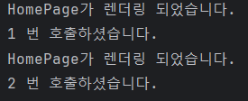

## Java Agent 만들어보기 1

### 개발 환경
* Java: 8
* IntelliJ: 2023.3

### 동작 방식

#### * 본인 Java Agent가 동작할 Java Project를 1번 프로젝트라 칭하고, Java Agent 파일을 2번 프로젝트라 칭하겠습니다.
1. 해당 Java Agent가 동작할 Java project(1번 프로젝트)를 만들고, 특정 메소드의 호출이 일정 횟수 일어나도록 코딩합니다.
2. 이 코드(2번 프로젝트)를 다운받아 본인이 호출한 메소드의 이름을 아래 코드의 "render" 안에 넣습니다.
    - `.transform((builder, typeDescription, classLoader, javaModule) -> builder.method(named("render"))`
3. 작성 완료 후 maven으로 package 하면 target에 .jar 파일이 생성되어 있습니다.
4. 그럼 경로를 잘 기억한 뒤 1번 프로젝트로 돌아가 Main을 한 번 돌려줍니다.
5. Edit Configurations 클릭
6. Run/Debug Configurations 클릭
7. Modify options 클릭 후 add VM option을 켜거나 alt+v 를 누름
8. VM option에 아래와 같이 -javaagent:경로 입력
   - `-javaagent:jar 경로 or .jar의 절대경로/MyAgent-1.0-SNAPSHOT.jar`
9. 이후 1번 프로젝트를 돌려 아래와 같은 결과가 나오면 잘 적용된 것입니다.

### 결과

